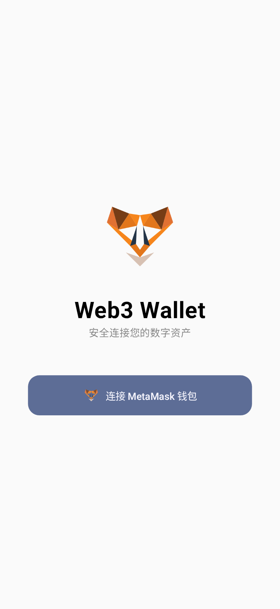
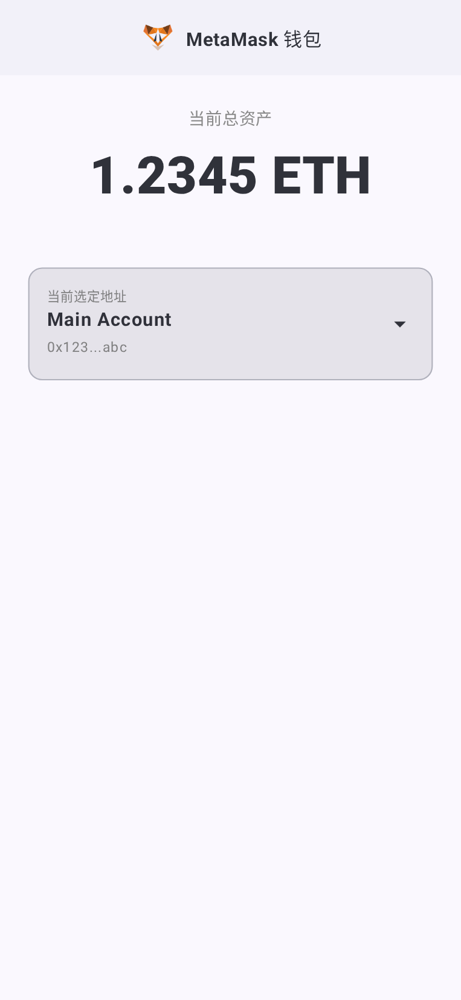

# MadKotlin Web3 Wallet

A modern Android Web3 wallet built with Kotlin and Jetpack Compose.

## Project Structure

This project follows the recommended modern Android development practices.

- **`app`**: The main application module (Android).
    - **`data`**: Implements the domain repository interfaces, handles data sources (Local, Remote).
    - **`domain`**: Contains the business logic (UseCases) and repository interfaces.
    - **`ui`**: Contains the UI layer (Compose screens, ViewModels, Theme).
    - **`di`**: Dependency Injection configuration.
- **`server`**: Lightweight Node.js (Express) backend service.
- **`docs`**: Project documentation.

## Tech Stack

- **UI**: Jetpack Compose
- **Concurrency**: Kotlin Coroutines & Flow
- **Dependency Injection**: Hilt / Koin (Planned)
- **Networking**: Retrofit / Ktor
- **Architecture**: MVVM / MVI with Clean Architecture

## Screenshots

| 1. Connect Screen | 2. Auth Success | 3. Wallet Dashboard |
| :---: | :---: | :---: |
|  |  |  |
